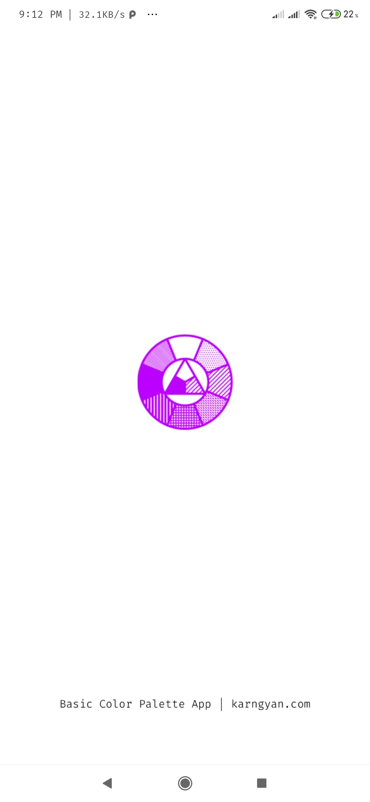
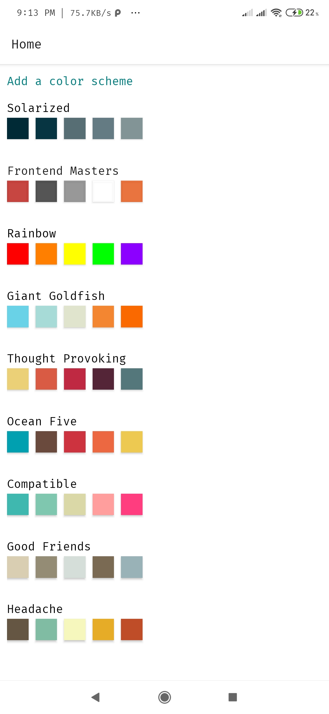
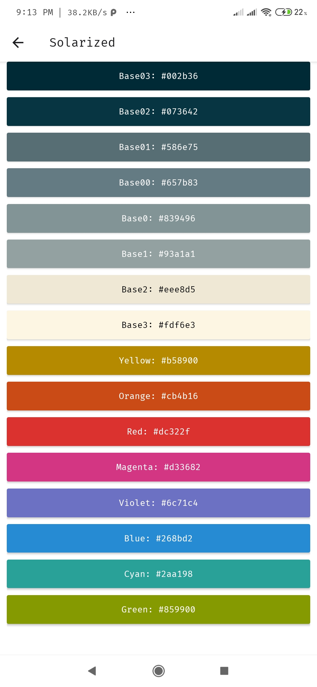
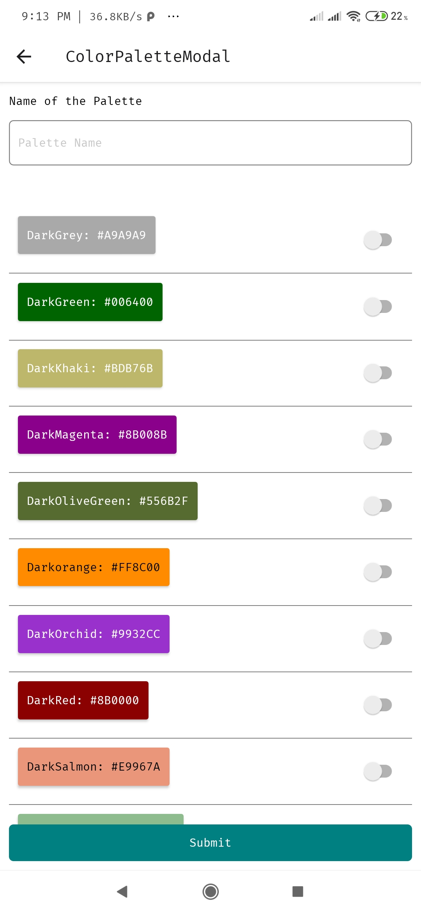

# Basic Color Palette

- Expo Page: [https://expo.io/@karngyan/ColorPalettes](https://expo.io/@karngyan/ColorPalettes)
- With an Android phone, you can scan this QR code with your Expo mobile app to load this project immediately.
- 

# Here's how it looks

Believe me I'm not a frontend guy.

# Copyright Information

[License](./LICENSE)
